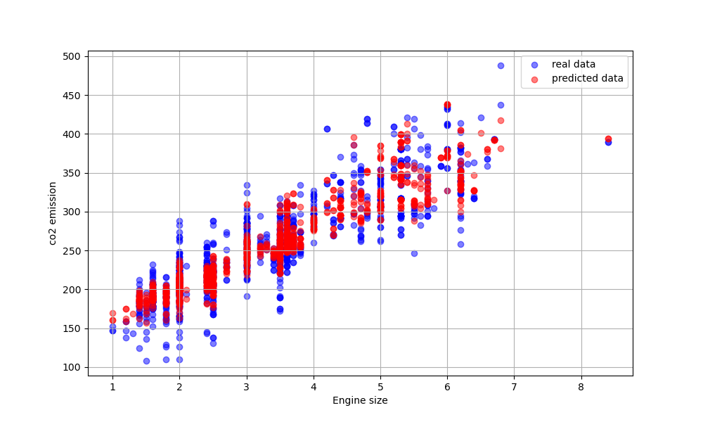

# Linear Regression from Scratch 🧠

Welcome! This is my implementation of **Linear Regression** built purely with NumPy.

I created this project because I wanted to look under the hood of Machine Learning algorithms. While libraries like Scikit-Learn are great, they often feel like "magic boxes." I wanted to understand the math properly—specifically how **Gradient Descent** actually updates weights to minimize error.

## 🎯 What's this project about?

It's a lightweight, vectorized implementation of Linear Regression. No black-box ML libraries were used, just pure Python and linear algebra.

Key features:

- **Vectorized Math:** I used `np.dot` instead of slow for-loops to make calculations efficient.
- **Gradient Descent:** Implemented the optimization algorithm manually to update weights (`w`) and bias (`b`) iteratively.
- **Scalable:** It handles multiple features (multivariate regression), not just simple 1D data.

## 📂 Structure

I tried to keep the code clean and production-ready:

- `src/`: The core logic resides here. The `LinearRegression` class mimics the Scikit-Learn API (using `.fit()` and `.predict()`).
- `tests/`: Basic sanity checks to ensure the math holds up (e.g., learning a simple `y = 2x + 5` relationship).
- `examples/`: A real-world demo predicting CO2 emissions based on engine size and fuel consumption.

## 🛠️ How to run it

First, clone the repo and install the dependencies (mainly NumPy, Pandas, and Matplotlib):

pip install -r requirements.txt

To see the model in action with the car dataset:

python examples/fuel_consumption_demo.py

## 📊 Results on Real Data

I tested the model on a **Fuel Consumption dataset**. The goal was to predict CO2 emissions based on engine characteristics.

- **RMSE (Error):** The model achieved an RMSE of around **23.36**, which is pretty solid for a linear model on this dataset.
- **Insights:** Interestingly, the model assigned the highest weight to "Fuel Consumption," correctly identifying it as the main driver for emissions.

You can see the regression fit in the plot below (generated by the example script):

## 🚀 What's Next?

This is just the beginning. I'm planning to:

- Implement **Logistic Regression** for classification tasks.
- Add regularization (Ridge/Lasso) to prevent overfitting.

Feel free to poke around the code! If you spot any bugs or have suggestions, let me know.
